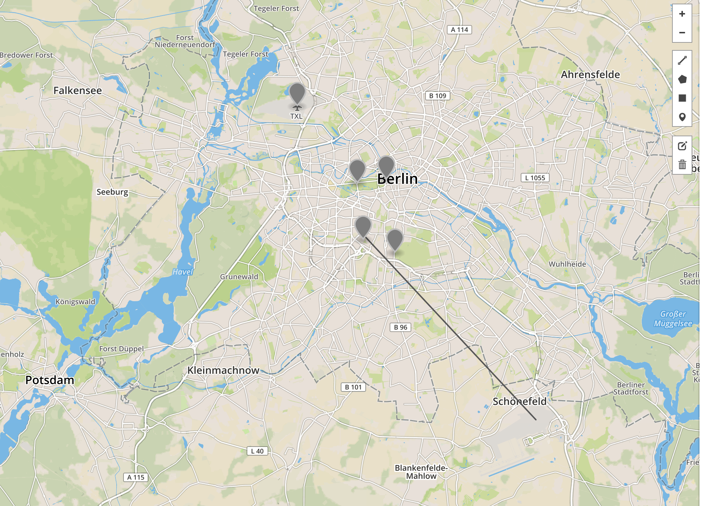

# java8-talk playground

this repo was used mainly as playground and to share some code I used in talks

## java8

some code to have a talk about java8 features and play with

## Immutables

some code to talk about Immutables and play with

